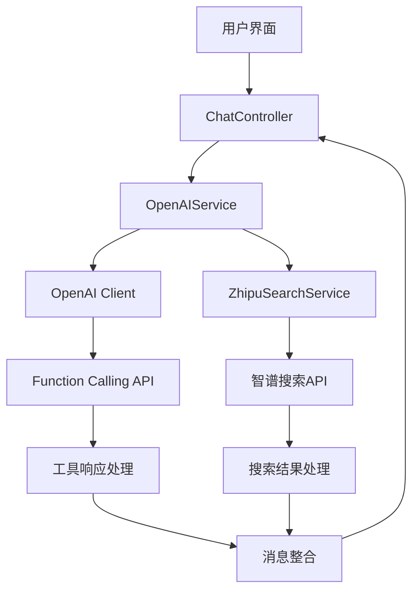
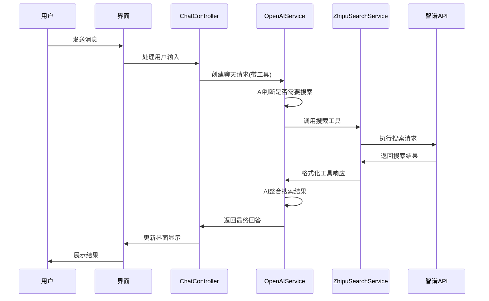

# 智谱AI Web Search Function Calling 集成方案

## 📋 项目概述

本文档详细描述了如何在现有Flutter AI聊天应用中集成智谱AI Web Search功能，通过OpenAI Function Calling机制实现AI自动搜索能力。

## 🎯 集成目标

1. **扩展OpenAI客户端**：添加Function Calling支持
2. **集成智谱AI搜索**：作为可调用的工具函数
3. **用户界面控制**：提供开关让用户选择是否启用搜索功能
4. **无缝体验**：AI可以在对话中自动调用搜索并整合结果

## 🏗️ 系统架构设计

### 整体架构图



### 数据流设计



## 📝 详细实施计划

### 阶段1：基础模型和数据结构

#### 1.1 Function Call相关模型

**文件**: `lib/models/function_call.dart`

```dart
// 工具定义模型
class FunctionDefinition {
  final String name;
  final String description;
  final Map<String, dynamic> parameters;
  
  FunctionDefinition({
    required this.name,
    required this.description,
    required this.parameters,
  });
  
  Map<String, dynamic> toJson() => {
    'name': name,
    'description': description,
    'parameters': parameters,
  };
}

// 工具调用模型
class FunctionCall {
  final String name;
  final String arguments;
  
  FunctionCall({
    required this.name,
    required this.arguments,
  });
  
  factory FunctionCall.fromJson(Map<String, dynamic> json) => FunctionCall(
    name: json['name'],
    arguments: json['arguments'],
  );
}

// 工具选择模型
class ToolChoice {
  final String type;
  final FunctionDefinition? function;
  
  ToolChoice({
    required this.type,
    this.function,
  });
  
  Map<String, dynamic> toJson() => {
    'type': type,
    if (function != null) 'function': function!.toJson(),
  };
}
```

#### 1.2 消息类型扩展

**文件**: `lib/models/message.dart` (扩展现有)

```dart
// 在现有Message模型中添加
enum MessageType {
  user,
  assistant,
  system,
  tool,        // 新增：工具调用消息
  toolResult,  // 新增：工具结果消息
}

class ToolCall {
  final String id;
  final String type;
  final FunctionCall function;
  
  ToolCall({
    required this.id,
    required this.type,
    required this.function,
  });
}

// 扩展Message类
class Message {
  // ... 现有字段
  final List<ToolCall>? toolCalls;
  final String? toolCallId;
  
  // ... 构造函数和方法
}
```

### 阶段2：智谱搜索服务实现

#### 2.1 智谱搜索服务

**文件**: `lib/services/zhipu_search_service.dart`

```dart
class ZhipuSearchService extends GetxService {
  final Dio _dio = Dio();
  static const String _baseUrl = 'https://open.bigmodel.cn/api/paas/v4';
  
  String? _apiKey;
  
  // 配置API Key
  void configure(String apiKey) {
    _apiKey = apiKey;
  }
  
  // 执行网页搜索
  Future<Map<String, dynamic>> webSearch({
    required String searchQuery,
    String searchEngine = 'search_std',
    int count = 5,
    String? searchDomainFilter,
    String searchRecencyFilter = 'noLimit',
    String contentSize = 'medium',
  }) async {
    if (_apiKey == null || _apiKey!.isEmpty) {
      throw Exception('智谱AI API Key未配置');
    }
    
    try {
      final response = await _dio.post(
        '$_baseUrl/web_search',
        data: {
          'search_query': searchQuery,
          'search_engine': searchEngine,
          'count': count,
          if (searchDomainFilter != null) 'search_domain_filter': searchDomainFilter,
          'search_recency_filter': searchRecencyFilter,
          'content_size': contentSize,
        },
        options: Options(
          headers: {
            'Authorization': 'Bearer $_apiKey',
            'Content-Type': 'application/json',
          },
        ),
      );
      
      return response.data;
    } catch (e) {
      print('智谱搜索API调用错误: $e');
      rethrow;
    }
  }
  
  // 格式化搜索结果为工具响应
  String formatSearchResults(Map<String, dynamic> searchResponse) {
    final searchResults = searchResponse['search_result'] as List?;
    if (searchResults == null || searchResults.isEmpty) {
      return '未找到相关搜索结果';
    }
    
    final StringBuffer buffer = StringBuffer();
    buffer.writeln('搜索结果：\n');
    
    for (int i = 0; i < searchResults.length && i < 5; i++) {
      final result = searchResults[i];
      buffer.writeln('${i + 1}. ${result['title']}');
      buffer.writeln('   来源: ${result['media']}');
      buffer.writeln('   链接: ${result['link']}');
      buffer.writeln('   摘要: ${result['content']}');
      if (result['publish_date'] != null) {
        buffer.writeln('   发布时间: ${result['publish_date']}');
      }
      buffer.writeln();
    }
    
    return buffer.toString();
  }
}
```

### 阶段3：OpenAI客户端扩展

#### 3.1 扩展Completions类

**文件**: `lib/clients/openai.dart` (扩展现有)

```dart
class Completions {
  // ... 现有代码
  
  // 扩展create方法支持tools
  Future<Map<String, dynamic>> create({
    required String model,
    required List<Map<String, dynamic>> messages,
    List<Map<String, dynamic>>? tools,  // 新增
    dynamic toolChoice,                  // 新增
    int? maxTokens,
    double? temperature,
    double? topP,
    int? n,
    bool? stream,
    String? stop,
    double? presencePenalty,
    double? frequencyPenalty,
    bool? logProbs,
    Map<String, dynamic>? user,
  }) async {
    Response response = await openAI.dio.post(
      '${openAI.baseUrl}/chat/completions',
      data: {
        'model': model,
        'messages': messages,
        if (tools != null) 'tools': tools,           // 新增
        if (toolChoice != null) 'tool_choice': toolChoice, // 新增
        if (maxTokens != null) 'max_tokens': maxTokens,
        if (temperature != null) 'temperature': temperature,
        if (topP != null) 'top_p': topP,
        if (n != null) 'n': n,
        if (stream != null) 'stream': stream,
        if (stop != null) 'stop': stop,
        if (presencePenalty != null) 'presence_penalty': presencePenalty,
        if (frequencyPenalty != null) 'frequency_penalty': frequencyPenalty,
        if (logProbs != null) 'logprobs': logProbs,
        if (user != null) 'user': user,
      },
      options: Options(headers: {
        'Authorization': 'Bearer ${openAI.apiKey}',
        'Content-Type': 'application/json',
      }),
    );
    return response.data;
  }
  
  // 扩展流式方法支持tools
  Stream<String> createStream({
    required String model,
    required List<Map<String, dynamic>> messages,
    List<Map<String, dynamic>>? tools,  // 新增
    dynamic toolChoice,                  // 新增
    // ... 其他参数
  }) async* {
    // 类似的实现，添加tools和toolChoice支持
    // ... 实现代码
  }
}
```

#### 3.2 工具定义管理

**文件**: `lib/services/tool_registry.dart`

```dart
class ToolRegistry extends GetxService {
  static final Map<String, FunctionDefinition> _tools = {};
  
  // 注册智谱搜索工具
  static void registerZhipuSearch() {
    _tools['zhipu_web_search'] = FunctionDefinition(
      name: 'zhipu_web_search',
      description: '使用智谱AI搜索引擎进行网页搜索，获取最新信息。当用户询问需要实时信息、最新新闻、当前事件或需要验证信息时使用。',
      parameters: {
        'type': 'object',
        'properties': {
          'search_query': {
            'type': 'string',
            'description': '搜索查询内容，应该是简洁明确的关键词',
          },
          'search_engine': {
            'type': 'string',
            'enum': ['search_std', 'search_pro'],
            'description': '搜索引擎类型，search_std为基础版，search_pro为高阶版',
            'default': 'search_std',
          },
          'count': {
            'type': 'integer',
            'minimum': 1,
            'maximum': 10,
            'description': '返回结果数量',
            'default': 5,
          },
        },
        'required': ['search_query'],
      },
    );
  }
  
  // 获取所有工具定义
  static List<Map<String, dynamic>> getAllTools() {
    return _tools.values.map((tool) => {
      'type': 'function',
      'function': tool.toJson(),
    }).toList();
  }
  
  // 获取特定工具
  static FunctionDefinition? getTool(String name) {
    return _tools[name];
  }
  
  // 检查工具是否存在
  static bool hasTool(String name) {
    return _tools.containsKey(name);
  }
}
```

### 阶段4：OpenAI服务扩展

#### 4.1 扩展OpenAIService

**文件**: `lib/services/openai_service.dart` (扩展现有)

```dart
class OpenAIService extends GetxService {
  // ... 现有代码
  
  late ZhipuSearchService _zhipuSearchService;
  
  @override
  void onInit() {
    super.onInit();
    _zhipuSearchService = Get.find<ZhipuSearchService>();
    ToolRegistry.registerZhipuSearch();
  }
  
  // 扩展聊天完成方法支持工具
  Future<Map<String, dynamic>?> createChatCompletionWithTools({
    required List<Map<String, dynamic>> messages,
    bool enableTools = false,
    int? maxTokens,
    double? temperature,
    // ... 其他参数
  }) async {
    if (!isConfigured) {
      throw Exception('OpenAI客户端未配置，请先设置模型和供应商');
    }
    
    List<Map<String, dynamic>>? tools;
    dynamic toolChoice;
    
    if (enableTools) {
      tools = ToolRegistry.getAllTools();
      toolChoice = 'auto';
    }
    
    try {
      final response = await currentClient!.chat.completions.create(
        model: currentModelId!,
        messages: messages,
        tools: tools,
        toolChoice: toolChoice,
        maxTokens: maxTokens,
        temperature: temperature,
        // ... 其他参数
      );
      
      // 处理工具调用
      if (response['choices']?[0]?['message']?['tool_calls'] != null) {
        return await _handleToolCalls(response, messages);
      }
      
      return response;
    } catch (e) {
      print('API调用错误: $e');
      rethrow;
    }
  }
  
  // 处理工具调用
  Future<Map<String, dynamic>> _handleToolCalls(
    Map<String, dynamic> response,
    List<Map<String, dynamic>> originalMessages,
  ) async {
    final message = response['choices'][0]['message'];
    final toolCalls = message['tool_calls'] as List;
    
    // 添加助手消息到对话历史
    final updatedMessages = List<Map<String, dynamic>>.from(originalMessages);
    updatedMessages.add(message);
    
    // 执行每个工具调用
    for (final toolCall in toolCalls) {
      final functionName = toolCall['function']['name'];
      final arguments = toolCall['function']['arguments'];
      
      String toolResult;
      try {
        toolResult = await _executeToolCall(functionName, arguments);
      } catch (e) {
        toolResult = '工具调用失败: $e';
      }
      
      // 添加工具结果到对话历史
      updatedMessages.add({
        'role': 'tool',
        'tool_call_id': toolCall['id'],
        'content': toolResult,
      });
    }
    
    // 再次调用API获取最终回答
    return await currentClient!.chat.completions.create(
      model: currentModelId!,
      messages: updatedMessages,
    );
  }
  
  // 执行具体的工具调用
  Future<String> _executeToolCall(String functionName, String arguments) async {
    switch (functionName) {
      case 'zhipu_web_search':
        return await _executeZhipuSearch(arguments);
      default:
        throw Exception('未知的工具: $functionName');
    }
  }
  
  // 执行智谱搜索
  Future<String> _executeZhipuSearch(String arguments) async {
    try {
      final args = jsonDecode(arguments);
      final searchQuery = args['search_query'] as String;
      final searchEngine = args['search_engine'] as String? ?? 'search_std';
      final count = args['count'] as int? ?? 5;
      
      final searchResponse = await _zhipuSearchService.webSearch(
        searchQuery: searchQuery,
        searchEngine: searchEngine,
        count: count,
      );
      
      return _zhipuSearchService.formatSearchResults(searchResponse);
    } catch (e) {
      return '搜索失败: $e';
    }
  }
}
```

### 阶段5：聊天控制器增强

#### 5.1 扩展ChatController

**文件**: `lib/controllers/chat_controller.dart` (扩展现有)

```dart
class ChatController extends GetxController {
  // ... 现有代码
  
  // 工具开关状态
  final RxBool isToolsEnabled = false.obs;
  
  // 发送消息方法扩展
  Future<void> sendMessage(String content) async {
    if (content.trim().isEmpty) return;
    
    // ... 现有的消息创建逻辑
    
    try {
      isLoading.value = true;
      
      // 使用带工具的API调用
      final response = await openAIService.createChatCompletionWithTools(
        messages: _buildMessageHistory(),
        enableTools: isToolsEnabled.value,
        temperature: 0.7,
      );
      
      // ... 处理响应逻辑
      
    } catch (e) {
      // ... 错误处理
    } finally {
      isLoading.value = false;
    }
  }
  
  // 切换工具开关
  void toggleTools() {
    isToolsEnabled.value = !isToolsEnabled.value;
    // 可以添加持久化存储
  }
  
  // 构建消息历史
  List<Map<String, dynamic>> _buildMessageHistory() {
    // ... 现有逻辑，需要支持工具消息类型
  }
}
```

### 阶段6：用户界面实现

#### 6.1 工具开关按钮

**文件**: `lib/pages/chat_page/chat_panel.dart` (扩展现有)

```dart
class ChatPanel extends StatelessWidget {
  // ... 现有代码
  
  Widget _buildToolToggleButton() {
    return Obx(() {
      final chatController = Get.find<ChatController>();
      return Container(
        margin: const EdgeInsets.only(right: 8),
        child: InkWell(
          onTap: chatController.toggleTools,
          borderRadius: BorderRadius.circular(20),
          child: Container(
            padding: const EdgeInsets.symmetric(horizontal: 12, vertical: 6),
            decoration: BoxDecoration(
              color: chatController.isToolsEnabled.value 
                ? Colors.blue.withOpacity(0.1)
                : Colors.grey.withOpacity(0.1),
              borderRadius: BorderRadius.circular(20),
              border: Border.all(
                color: chatController.isToolsEnabled.value 
                  ? Colors.blue 
                  : Colors.grey,
                width: 1,
              ),
            ),
            child: Row(
              mainAxisSize: MainAxisSize.min,
              children: [
                Icon(
                  Icons.search,
                  size: 16,
                  color: chatController.isToolsEnabled.value 
                    ? Colors.blue 
                    : Colors.grey,
                ),
                const SizedBox(width: 4),
                Text(
                  '联网搜索',
                  style: TextStyle(
                    fontSize: 12,
                    color: chatController.isToolsEnabled.value 
                      ? Colors.blue 
                      : Colors.grey,
                  ),
                ),
              ],
            ),
          ),
        ),
      );
    });
  }
  
  // 在消息输入区域添加工具按钮
  Widget _buildMessageInput() {
    return Row(
      children: [
        _buildToolToggleButton(),
        Expanded(
          child: // ... 现有的输入框
        ),
        // ... 发送按钮
      ],
    );
  }
}
```

#### 6.2 搜索结果展示

**文件**: `lib/pages/chat_page/chat_panel/message_list.dart` (扩展现有)

```dart
// 添加工具调用消息的显示组件
class ToolCallMessageWidget extends StatelessWidget {
  final Message message;
  
  const ToolCallMessageWidget({Key? key, required this.message}) : super(key: key);
  
  @override
  Widget build(BuildContext context) {
    return Container(
      margin: const EdgeInsets.symmetric(vertical: 4),
      padding: const EdgeInsets.all(12),
      decoration: BoxDecoration(
        color: Colors.blue.withOpacity(0.1),
        borderRadius: BorderRadius.circular(8),
        border: Border.all(color: Colors.blue.withOpacity(0.3)),
      ),
      child: Column(
        crossAxisAlignment: CrossAxisAlignment.start,
        children: [
          Row(
            children: [
              Icon(Icons.search, size: 16, color: Colors.blue),
              const SizedBox(width: 4),
              Text(
                '正在搜索...',
                style: TextStyle(
                  fontSize: 12,
                  color: Colors.blue,
                  fontWeight: FontWeight.w500,
                ),
              ),
            ],
          ),
          if (message.content.isNotEmpty) ...[
            const SizedBox(height: 8),
            Text(
              message.content,
              style: const TextStyle(fontSize: 14),
            ),
          ],
        ],
      ),
    );
  }
}
```

### 阶段7：配置管理

#### 7.1 智谱AI配置

**文件**: `lib/pages/setting_page/zhipu_setting_page.dart`

```dart
class ZhipuSettingPage extends StatelessWidget {
  final TextEditingController _apiKeyController = TextEditingController();
  
  @override
  Widget build(BuildContext context) {
    return Scaffold(
      appBar: AppBar(title: const Text('智谱AI配置')),
      body: Padding(
        padding: const EdgeInsets.all(16),
        child: Column(
          crossAxisAlignment: CrossAxisAlignment.start,
          children: [
            const Text('API Key', style: TextStyle(fontWeight: FontWeight.bold)),
            const SizedBox(height: 8),
            TextField(
              controller: _apiKeyController,
              decoration: const InputDecoration(
                hintText: '请输入智谱AI API Key',
                border: OutlineInputBorder(),
              ),
              obscureText: true,
            ),
            const SizedBox(height: 16),
            ElevatedButton(
              onPressed: _saveConfiguration,
              child: const Text('保存配置'),
            ),
          ],
        ),
      ),
    );
  }
  
  void _saveConfiguration() {
    final zhipuService = Get.find<ZhipuSearchService>();
    zhipuService.configure(_apiKeyController.text);
    Get.back();
  }
}
```

## 🧪 测试计划

### 单元测试
1. **ZhipuSearchService测试**
   - API调用测试
   - 错误处理测试
   - 结果格式化测试

2. **ToolRegistry测试**
   - 工具注册测试
   - 工具定义验证测试

3. **OpenAIService扩展测试**
   - Function Calling流程测试
   - 工具调用处理测试

### 集成测试
1. **完整对话流程测试**
   - 用户消息 → AI判断 → 工具调用 → 结果整合
   - 多轮对话中的工具调用
   - 错误恢复测试

2. **用户界面测试**
   - 工具开关功能测试
   - 搜索结果展示测试
   - 配置页面测试

## 🚀 部署和发布

### 依赖添加
在`pubspec.yaml`中添加必要依赖：

```yaml
dependencies:
  # ... 现有依赖
  dio: ^5.3.2  # 如果还没有
```

### 配置文件
创建配置文件存储API密钥和设置。

### 版本发布
1. 功能测试完成
2. 性能优化
3. 用户文档更新
4. 版本发布

## 📊 性能优化建议

1. **缓存机制**：对搜索结果进行适当缓存
2. **请求限流**：避免频繁API调用
3. **异步处理**：确保UI响应性
4. **错误重试**：网络错误自动重试机制

## 🔒 安全考虑

1. **API密钥安全**：本地加密存储
2. **输入验证**：搜索查询内容验证
3. **权限控制**：用户可控制工具使用
4. **数据隐私**：搜索历史本地存储

## 📝 总结

本方案提供了完整的智谱AI Web Search Function Calling集成解决方案，包括：

- 完整的技术架构设计
- 详细的代码实现计划
- 用户界面设计方案
- 测试和部署策略

实施后，用户将能够：
- 通过简单的开关控制AI搜索功能
- 在对话中获得实时、准确的网络信息
- 享受无缝的AI助手体验

该方案充分利用了现有的应用架构，最小化了对现有代码的影响，同时提供了强大的扩展能力。